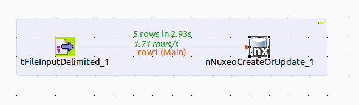
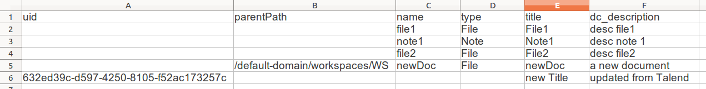
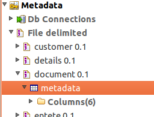
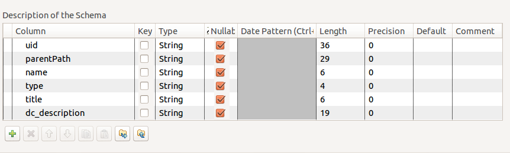
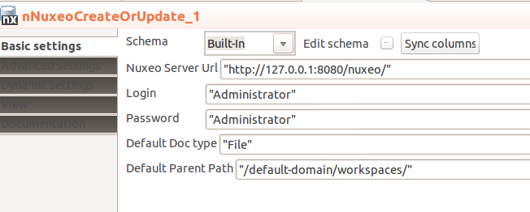
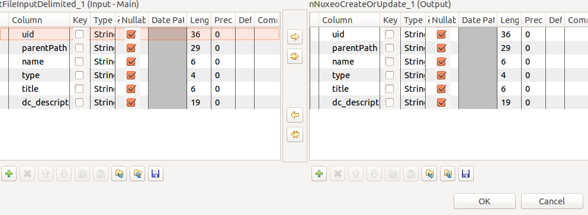

## Create / Update Document from a Talend Job

### Target Job structure

We'll start with a very simple Job with only 2 components :

 - one component to read the data : `tFileInputDelimited`
 - one component to Create or Update Document in Nuxeo : `nNuxeoCreateOrUpdate`

### Source file

We'll use a simple CSV file for this sample.

 - each row will correspond to a document to create or update
 - the first row will be used as headers
 - the columns will match document properties
     - uid : is the uid of the document
     - parentPath : is the path of the parent Document
     - name : is the name of the target Document
     - title : is the title of the Document
     - xx_yyy : is the property(xx:yyy) in the target Document

The create / update logic is :

 - if uid property is not null : use update
 - use create otherwise

The properties need to have their `:` escaped :

 - dc:description => dc_description
 - file:filename => file_filename

### tFileInputDelimited

In Metadata/File Delimited create a new entry and make it point to your CSV file.

Let the CSV importer guess the schema : 

### nNuxeoCreateOrUpdate

 - drop the Nuxeo coponent in the job.
 - link it to the `tFileInputDelimited`
 - configure the `nNuxeoCreateOrUpdate`

Sync the schema from the output of `tFileInputDelimited`

