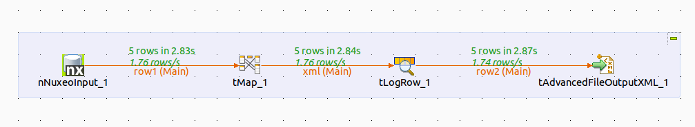
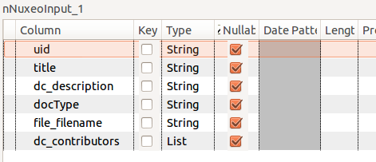
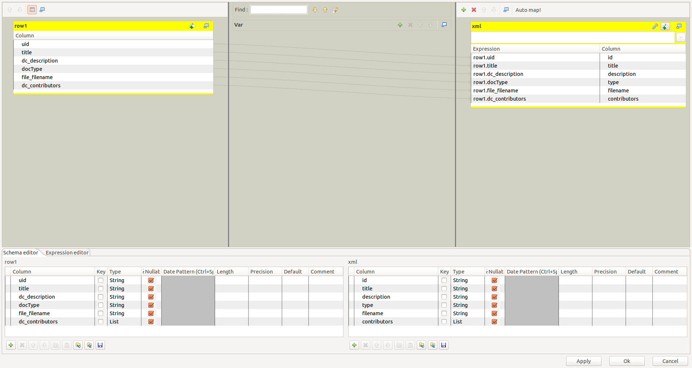
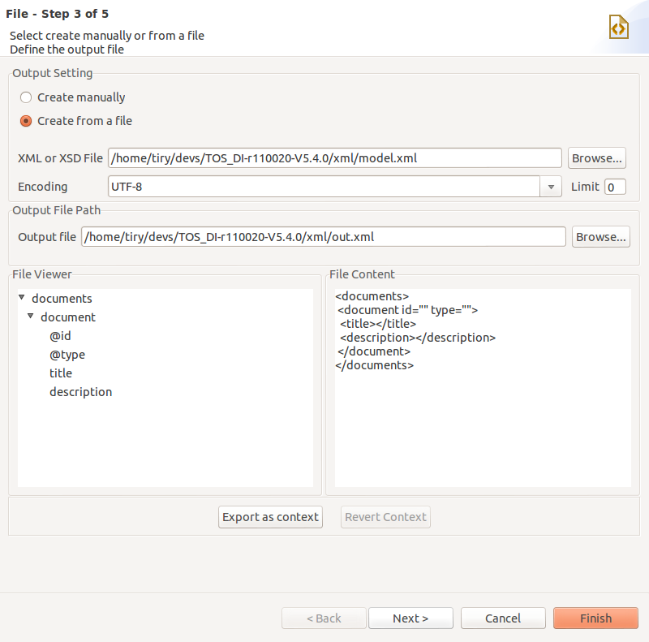
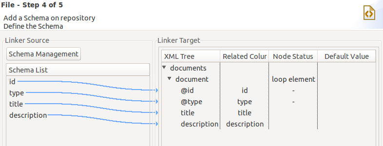

## Fetch Nuxeo Document from a Talend Job

### Target Job structure

Our sample jobs contains 4 components 

 - one component to read the documents from Nuxeo  : `nNuxeoInput`
 - one component to do mapping : `tMap`
 - one component to do some logging : `tLogRow`
 - one component to generaate XML : `tAdvancedFileOutputXml`

  
#### nNuxeoInput

Enter a NXQL Query, for the example we used : 

     "Select * from File where ecm:mixinType != 'HiddenInNavigation' order by dc:modified desc"

For output we define a schema to map the poperties we want 

 - title => dc:title 
 - dc_description => dc:description
 - file_filename => file:filename
 - ...

#### tMap

We use the tMap to do simple mapping.

#### tLogRow

Use simple automatic mapping.

#### tAdvancedFileOutputXml

We use [model.xml](model.xml) 

     <documents>
      <document id="" type="">
       <title></title>
       <description></description>
      </document>
     </documents>

as template to define an output format :

`document` is defined as a loop enement and the mapping is defined as 

### Output 

#### tLogRow output

     .------------------------------------+-----------+-------------------+----+---------------------+---------------.
     |                                                   tLogRow_1                                                   |
     |=-----------------------------------+-----------+-------------------+----+---------------------+--------------=|
     |id                                  |title      |description        |type|filename             |contributors   |
     |=-----------------------------------+-----------+-------------------+----+---------------------+--------------=|
     |e63ed4b4-2893-4432-8f4c-2951234a6530|newDoc     |a new document     |File|Nuxeo Scaling v3.pdf |[Administrator]|
     |632ed39c-d597-4250-8105-f52ac173257c|Talend File|updated from Talend|File|Nuxeo-WebEngine.pdf  |[Administrator]|
     |dde8353b-2afb-448a-894c-69b7f3f5414e|TestFIle   |Sample file        |File|schemas-doc-nuxeo.odp|[Administrator]|
     |1ab3564f-2444-4970-9736-7e6194e3b767|File2      |desc file2         |File|null                 |[Administrator]|
     |912f8cc2-5982-4fe1-81f2-5d21c8418f9a|Note1      |desc note 1        |File|null                 |[Administrator]|
     '------------------------------------+-----------+-------------------+----+---------------------+---------------'

#### XML output

     <?xml version="1.0" encoding="ISO-8859-15"?>
     <documents>
       <document id="e63ed4b4-2893-4432-8f4c-2951234a6530" type="File">
         <title>newDoc</title>
         <description>a new document</description>
       </document>
       <document id="632ed39c-d597-4250-8105-f52ac173257c" type="File">
         <title>Talend File</title>
         <description>updated from Talend</description>
       </document>
       <document id="dde8353b-2afb-448a-894c-69b7f3f5414e" type="File">
         <title>TestFIle</title>
         <description>Sample file</description>
       </document>
       <document id="1ab3564f-2444-4970-9736-7e6194e3b767" type="File">
         <title>File2</title>
         <description>desc file2</description>
       </document>
       <document id="912f8cc2-5982-4fe1-81f2-5d21c8418f9a" type="File">
         <title>Note1</title>
         <description>desc note 1</description>
       </document>
     </documents>

